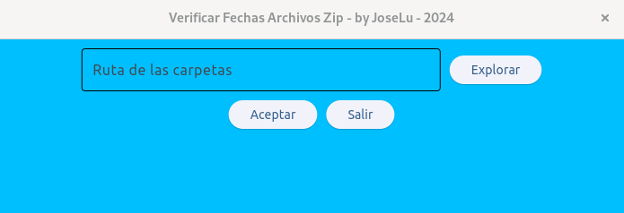

# Verificar Fechas Archivos Zip

* Objetivo
* Herramientas
* Conclusión

---
## Objetivo
El objetivo de este respositorio es subir mis prácticas, en este caso utilizando cómo lenguaje de programación **Python**.
Después de investigar e ir comparando código, fuí desarrollando de a poco esta app. La misma es con fines educativos, no soy responsable por el uso que se le de a la misma.
En este caso este programa surge por la necesidad de recorrer varias carpetas que cada una contiene un archivo .zip, dentro de la misma tengo archivos que no siempre coinciden con la fecha de esa copia (.zip), por ese motivo para no tener que entrar de manera manual a cada carpeta, descomprimir el zip y verificar la fecha del archivo nace este pequeño programa que recorre y exporta esa información a un excel.

## Herramientas
* flet
* pandas
* openpyxl
* odfpy
* pillow

## Conclusión
